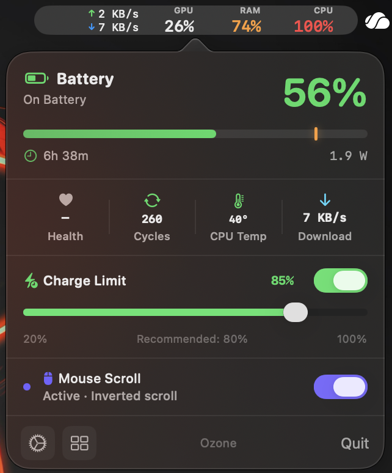
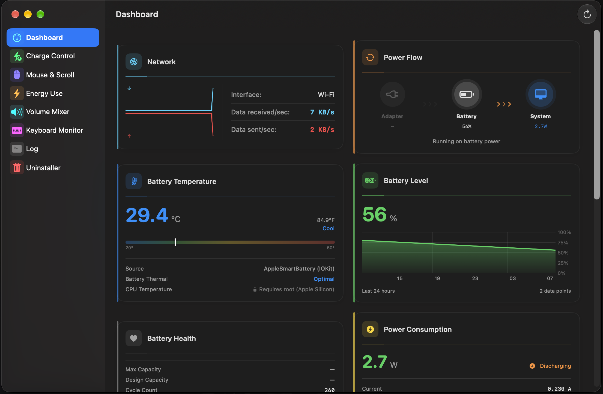
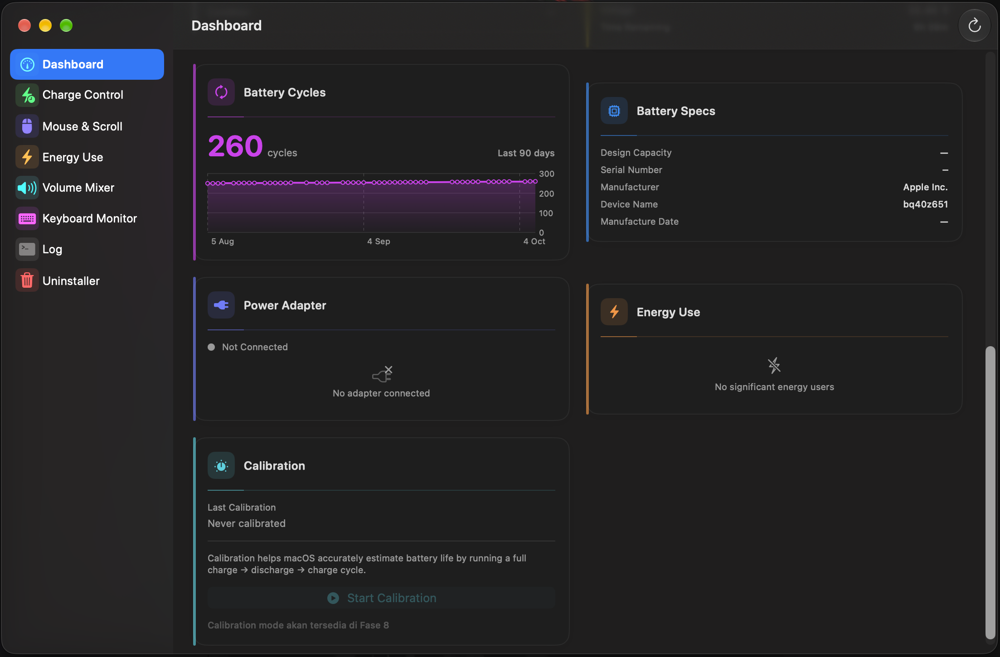
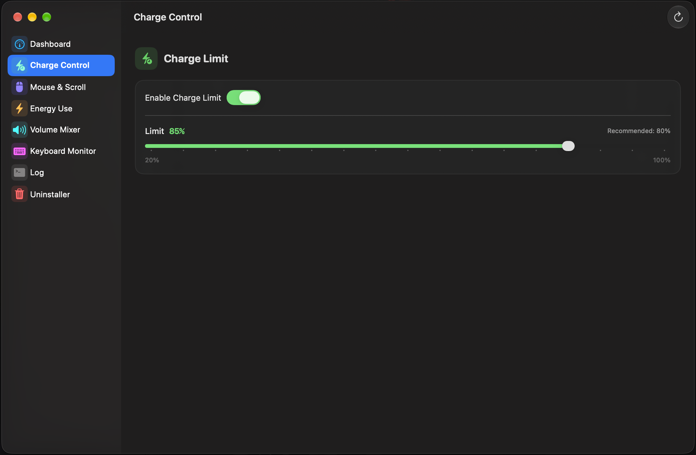
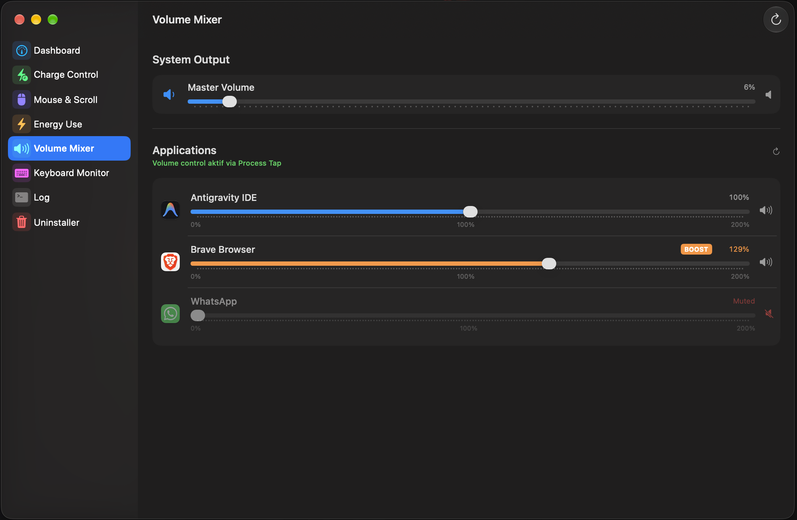
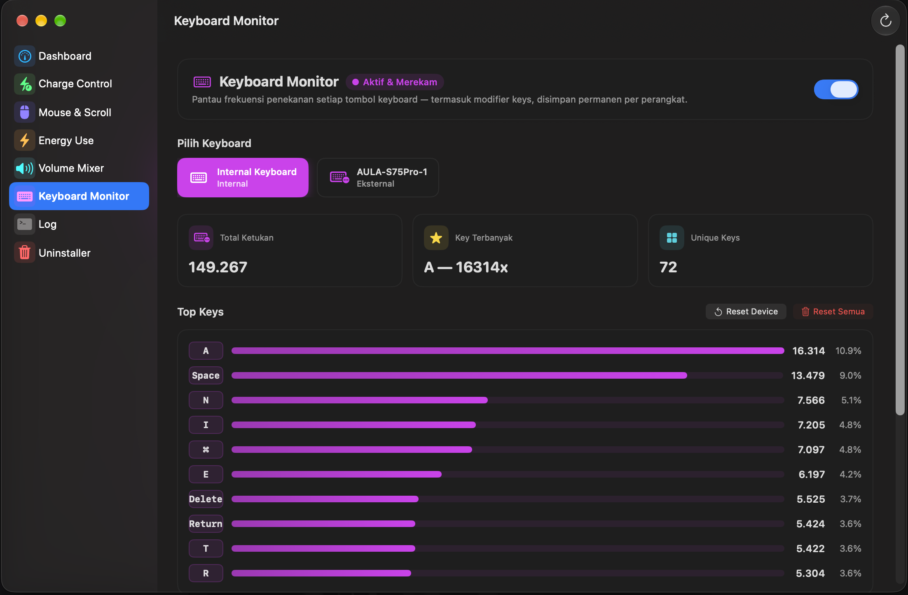
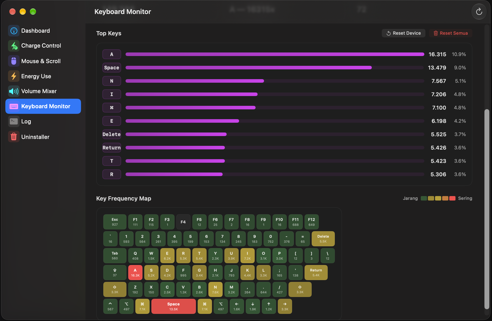
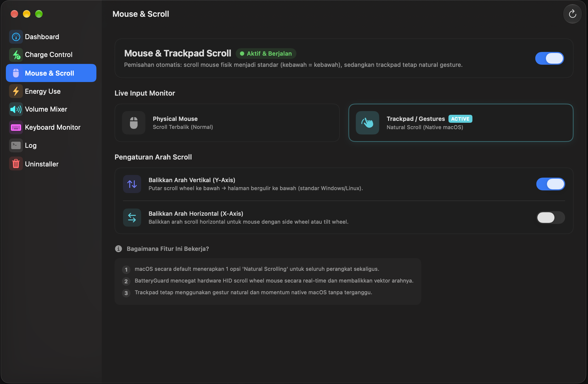
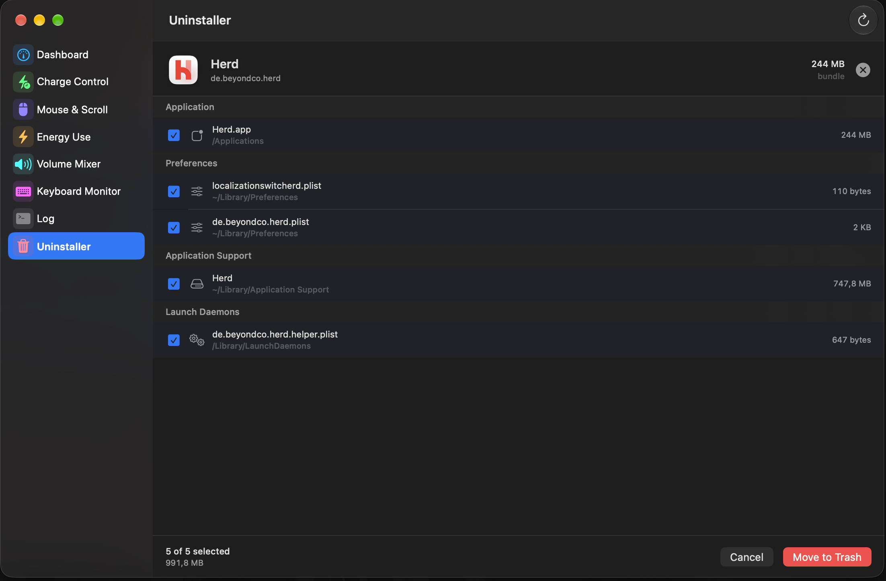
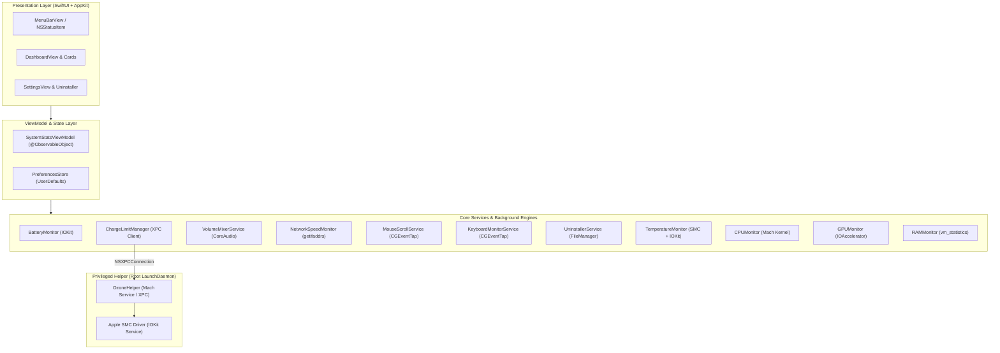

<div align="center">

# Ozone

**The ultimate macOS system companion & power management suite.**  
Engineered for Apple Silicon & Intel Macs — built with precision, designed with care.

<br/>

[](https://apple.com/macos)
[](https://swift.org)
[](https://apple.com)
[](https://github.com/yonaskolb/XcodeGen)
[](LICENSE)

<br/>

> **Ozone** is an open-source macOS app that lives in your menu bar.  
> One app for battery monitoring, per-app audio mixing, real-time hardware telemetry,  
> keyboard analytics, mouse scroll decoupling, and deep app uninstalling — all in one elegant UI.

</div>

---

## ✨ Feature Highlights

<table>
  <tr>
    <td align="center" width="160"><h3>🔋</h3><b>Battery & SMC</b><br/><sub>Hardware-level charge limiter via Apple SMC</sub></td>
    <td align="center" width="160"><h3>🎚️</h3><b>Volume Mixer</b><br/><sub>Per-app audio control via CoreAudio Process Taps</sub></td>
    <td align="center" width="160"><h3>📊</h3><b>Telemetry Hub</b><br/><sub>CPU · GPU · RAM · Network · Thermal</sub></td>
    <td align="center" width="160"><h3>⌨️</h3><b>Keyboard Monitor</b><br/><sub>Live keystroke heatmap & typing analytics</sub></td>
  </tr>
  <tr>
    <td align="center" width="160"><h3>🖱️</h3><b>Scroll Decoupler</b><br/><sub>Invert mouse scroll without affecting trackpad</sub></td>
    <td align="center" width="160"><h3>🧹</h3><b>App Uninstaller</b><br/><sub>Deep scan & purge all leftover app files</sub></td>
    <td align="center" width="160"><h3>📡</h3><b>Network Speed</b><br/><sub>Live upload & download rates in the menu bar</sub></td>
    <td align="center" width="160"><h3>🌡️</h3><b>Thermal Zones</b><br/><sub>Multi-zone CPU, GPU & battery temperatures</sub></td>
  </tr>
</table>

---

## 🗺️ Feature Map

```
╔══════════════════════════════════════════════════════════════════════════════════╗
║                                ⚡  OZONE                                         ║
╠══════════════╦═══════════════╦══════════════╦═══════════════╦═══════════════════╣
║ 🔋 Battery   ║ 🎚️ Audio Mixer ║ 📊 Telemetry ║ ⌨️ Keyboard   ║ 🖱️ Mouse & Unins. ║
╠══════════════╬═══════════════╬══════════════╬═══════════════╬═══════════════════╣
║ Charge Limit ║ Per-App Fader ║ CPU P+E Core ║ Key Heatmap   ║ Scroll Inversion  ║
║ Sailing Mode ║ Mute / Solo   ║ GPU & VRAM   ║ Press Counter ║ Deep App Scanner  ║
║ Top-Up Mode  ║ VU Meter      ║ RAM Pressure ║ WPM Estimator ║ Junk Purger       ║
║ Cycle Count  ║ Volume Boost  ║ Network Speed║ Session Stats ║ Trash Integration ║
║ Health Score ║ Audio Routing ║ Thermal Map  ║ History Log   ║ Safe Remove Mode  ║
║ Power Flow W ║ +200% Amplify ║ Top Drainers ║ Layout Support║ Disk Space Meter  ║
╚══════════════╩═══════════════╩══════════════╩═══════════════╩═══════════════════╝
```

---

## 🖥️ Menu Bar & Dashboard

Ozone lives in your menu bar, showing live battery %, network speed, CPU temp, and RAM usage at a glance — without ever opening a window.



Click the menu bar icon to open the full dashboard — a modular card-based layout covering every aspect of your system.





---

## 🔋 1. Battery Health & SMC Charge Management

Communicates directly with the **Apple System Management Controller (SMC)** through a privileged helper daemon to control battery charge thresholds at the hardware level.

| Feature | Details |
|:---|:---|
| **Hardware Charge Limiter** | Writes directly to SMC registers `CHTE` & `BCLM` — not a software workaround |
| **Sailing Mode** | Stops charging at a set threshold (default 80%), bypasses current directly to AC |
| **Top-Up Mode** | Triggers a full 100% charge cycle before traveling |
| **Power Telemetry** | Real-time State of Charge, Amperage, Voltage, and Wattage |
| **Battery Health Score** | Design Capacity vs. Maximum Capacity comparison with degradation estimate |
| **Cycle Analytics** | Cycle count, history graph, and estimated remaining battery lifespan |
| **Adapter Info** | Charger specs: Wattage, Voltage, Amperage, and manufacturer name |

> 💡 **Why it matters:** Consistently keeping your battery below 80% can **extend battery lifespan up to 2× longer** according to Battery University data.



---

## 🎚️ 2. Per-App Volume Mixer & Audio Routing

Powered by **CoreAudio Process Taps** — the same technology used by professional audio applications.

| Component | Technology |
|:---|:---|
| **Audio Interception** | `AudioHardwareCreateProcessTap` + Aggregate Device — zero-latency |
| **Per-App Faders** | Granular volume sliders per active audio-producing process |
| **VU Meter** | Live RMS & peak meter with real-time animation |
| **Mute / Solo** | Individual controls without affecting other processes |
| **Volume Boost** | Amplify up to **+200%** with a soft-knee limiter using `vDSP` (Accelerate) |
| **Audio Routing** | Route specific apps to headphones, DAC, or external monitors independently |



---

## 📊 3. Real-Time System Telemetry

Read directly from the macOS kernel — not estimates or high-interval polling.

```
┌─ CPU ──────────────────────────────────────────────────────┐
│  P-Core (Performance): ████████░░ 78%                      │
│  E-Core (Efficiency):  ███░░░░░░░ 32%                      │
│  User · System · Idle  — via host_processor_info()         │
├─ GPU & VRAM ───────────────────────────────────────────────┤
│  Utilization: ██████░░░░ 61%     VRAM: 3.2 GB / 8 GB      │
│  Source: IOKit IOAccelerator statistics                     │
├─ Memory ───────────────────────────────────────────────────┤
│  Active: 8.1 GB  │  Wired: 2.3 GB  │  Compressed: 1.1 GB  │
│  Free: 4.5 GB    │  Cached: 6.2 GB │  Pressure: Normal     │
├─ Network ──────────────────────────────────────────────────┤
│  ↓ 12.4 MB/s   ↑ 2.1 MB/s   — via high-freq getifaddrs()  │
└────────────────────────────────────────────────────────────┘
```

- **Energy Consumers:** Identifies the most power-hungry background processes
- **Thermal Sensors:** Multi-zone temperature readouts across CPU cores, GPU clusters, and battery cells via SMC

---

## ⌨️ 4. Keyboard Monitor & Analytics

A unique feature that records and visualizes your typing patterns locally — **100% offline, data never leaves your Mac**.

| Feature | Description |
|:---|:---|
| **Live Heatmap** | Keyboard layout visualization with color intensity based on key press frequency |
| **Key Counter** | Total key presses per key in the active session and saved history |
| **WPM Estimator** | Typing speed estimate based on character output |
| **Session Stats** | Per-session stats: duration, total keystrokes, top keys |
| **History Log** | Locally stored session history for long-term analysis |
| **Layout Support** | Supports multiple standard keyboard layouts |

> 🔒 **Privacy First:** Keystroke data is **stored locally only** and never sent to any server.





---

## 🖱️ 5. Mouse & Trackpad Scroll Decoupler

One of the most-wanted features for macOS users with external mice — now available with a native implementation.

- **`CGEventTap` (Accessibility Level):** Intercepts scroll wheel events at a low level before they reach any application
- **Natural Trackpad Preserved:** macOS trackpad gestures remain completely unaffected
- **Zero-Config:** Enable once, works system-wide with no restart required



---

## 🧹 6. Complete Application Uninstaller

Drag-and-drop app cleaner that leaves nothing behind.

**Automatically scanned directories:**
```
~/Library/Application Support/      ~/Library/Caches/
~/Library/Caches/WebKit/            ~/Library/Preferences/
~/Library/Preferences/ByHost/       ~/Library/Saved Application State/
~/Library/Logs/                     ~/Library/HTTPStorages/
~/Library/Containers/               ~/Library/Group Containers/
~/Library/LaunchAgents/
```

- **Disk Space Calculator:** Shows total reclaimable space before deletion
- **Safe Remove:** Files are moved to Trash (not permanently deleted) — fully undoable!



---

## 🏗️ Architecture & Technology Stack

Ozone is built with a modular, decoupled architecture adhering to **SOLID**, **DRY**, and **KISS** principles.



### Technology Stack

| Layer | Technology |
|:---|:---|
| **UI Framework** | SwiftUI 5 + AppKit (`NSStatusItem`, `NSPopover`, `NSWindowController`) |
| **Audio Engine** | CoreAudio Process Taps, AudioToolbox, Accelerate (`vDSP`) |
| **Hardware & Kernel** | IOKit (`IOPMPowerSource`, `AppleSmartBattery`), Mach Kernel APIs, `sysctl` |
| **Input Monitoring** | `CGEventTap` (Accessibility framework) |
| **Privileged IPC** | `ServiceManagement` (`SMJobBless`), `NSXPCConnection`, LaunchDaemons |
| **Build System** | [XcodeGen](https://github.com/yonaskolb/XcodeGen) — declarative project configuration |
| **Min. macOS** | macOS 13.0 Ventura (universal binary: Apple Silicon + Intel) |

---

## 📁 Repository Structure

```
Ozone/
├── BatteryGuard/                        # Main macOS Application Target
│   ├── App/                             # Entry point & AppDelegate (NSWindowController)
│   ├── MenuBar/                         # NSStatusItem popup & Quick Stats bar
│   ├── Dashboard/                       # Main dashboard window
│   │   ├── Cards/                       # 15 modular feature cards:
│   │   │   ├── BatteryLevelCard.swift   #   Real-time SoC gauge
│   │   │   ├── BatteryHealthCard.swift  #   Capacity & health score
│   │   │   ├── BatteryCyclesCard.swift  #   Cycle count & history chart
│   │   │   ├── BatteryTemperatureCard.swift # Thermal zone readouts
│   │   │   ├── PowerFlowCard.swift      #   Live Watt/Volt/Amp display
│   │   │   ├── PowerAdapterCard.swift   #   Charger specifications
│   │   │   ├── PowerConsumptionCard.swift #  Energy drain breakdown
│   │   │   ├── NetworkSpeedCard.swift   #   Up/Down speed graph
│   │   │   ├── EnergyAppsCard.swift     #   Top energy-consuming processes
│   │   │   ├── VolumeMixerView.swift    #   Per-app audio mixer UI
│   │   │   ├── KeyboardMonitorView.swift #  Keystroke heatmap & analytics
│   │   │   ├── MouseControlView.swift   #   Scroll & mouse settings
│   │   │   ├── CalibrationCard.swift    #   Battery calibration guide
│   │   │   └── BatterySpecsCard.swift   #   Hardware specifications
│   │   └── Sidebar/                     # Navigation sidebar
│   ├── Services/                        # 21 background engines & monitors
│   ├── ViewModels/                      # Observable state aggregators
│   ├── Models/                          # Data structs & telemetry types
│   ├── Settings/                        # Preferences & configurations
│   ├── Uninstaller/                     # App uninstaller engine & UI
│   └── XPC/                             # XPC client connection manager
│
├── BatteryGuardHelper/                  # Privileged Root Helper Daemon
│   ├── main.swift                       # Mach service listener entrypoint
│   ├── HelperTool.swift                 # XPC protocol implementation
│   ├── SMCController.swift              # Low-level SMC read/write routines
│   └── Info.plist & Entitlements        # LaunchDaemon configuration
│
├── Shared/                              # Shared XPC protocols
│   └── BatteryGuardXPCProtocol.swift
│
├── Assets/                              # Screenshots & preview images
├── Scripts/                             # Automation & diagnostic tools
│   ├── install_helper.sh                # Privileged daemon installer
│   └── smc_attr_scan.swift              # Standalone SMC register scanner
│
├── References/                          # Reference docs & benchmarks
├── project.yml                          # XcodeGen project specification
└── README.md
```

---

## 🚀 Getting Started

### Prerequisites

| Requirement | Version |
|:---|:---|
| macOS | **13.0 Ventura** or newer |
| Xcode | **15.0+** |
| Swift | **5.9+** |
| XcodeGen | **Latest** (`brew install xcodegen`) |
| Architecture | Apple Silicon (M1/M2/M3/M4) or Intel Mac |

### Build from Source

```bash
# 1. Clone the repository
git clone https://github.com/adityaibrar/BatteryGuard.git
cd BatteryGuard

# 2. Generate the Xcode project
xcodegen generate

# 3. Open in Xcode
open BatteryGuard.xcodeproj

# 4. Build & Run — select the "BatteryGuard" scheme, then Cmd + R
```

### Installing the Privileged Helper Daemon

> **Required for the Battery Charge Limiter feature (SMC register control).**

```bash
# 1. Copy the built app to /Applications
# 2. Install the helper daemon with root privileges
sudo bash Scripts/install_helper.sh
```

The helper will be registered at:
```
/Library/PrivilegedHelperTools/com.ibrardev.BatteryGuard.Helper  <- binary
/Library/LaunchDaemons/com.ibrardev.BatteryGuard.Helper.plist    <- launchd config
```

---

## 🔒 Permissions & Security

Ozone is designed with a **minimum required permissions** policy.

| Permission | Purpose | Required For |
|:---|:---|:---|
| **Privileged Helper (`launchd`)** | Write to SMC registers (`CHTE`, `BCLM`) | Battery charge limiter & hardware control |
| **Accessibility (`AXIsProcessTrusted`)** | `CGEventTap` to intercept scroll & keystroke events | Mouse scroll decoupler & Keyboard monitor |
| **Audio Capture (Process Tap)** | Real-time CoreAudio per-process stream tapping | Per-app volume mixer & audio routing |

> 🔒 **Privacy Guarantee:** Ozone runs **100% locally** on your Mac. No telemetry, no audio data, and no keystrokes are ever transmitted over any network.

---

## 🛠️ Utility Scripts

| Script | Description |
|:---|:---|
| [`install_helper.sh`](Scripts/install_helper.sh) | Install & start the helper daemon as a LaunchDaemon |
| [`smc_attr_scan.swift`](Scripts/smc_attr_scan.swift) | Interactive CLI to inspect SMC keys & verify writable registers |

```bash
# Run the SMC register scanner
sudo swift Scripts/smc_attr_scan.swift
```

---

## 🤝 Contributing

Contributions, feature ideas, and pull requests are very welcome!

```bash
git checkout -b feat/amazing-feature
git commit -m "feat: add some amazing feature"
git push origin feat/amazing-feature
# -> Open a Pull Request
```

> Please ensure your code follows the **SOLID**, **DRY**, and **KISS** principles already applied throughout the codebase.

---

## 📄 License

This project is licensed under the **MIT License**.  
Some audio mixer components reference implementations licensed under **GNU GPL v3.0+**.  
See [LICENSE](LICENSE) for full details.

---

<div align="center">

**Ozone** — Crafted with ❤️ for macOS power users

by [Aditya Ibrar](https://github.com/adityaibrar)

*"Your Mac deserves better than default."*

</div>
